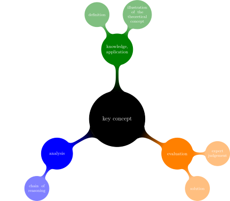
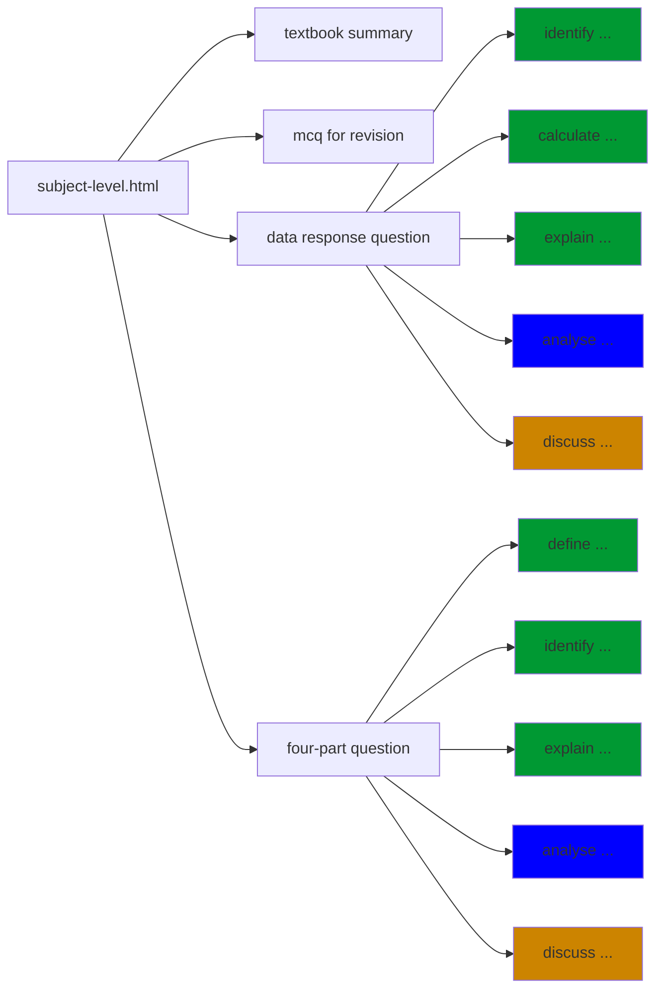
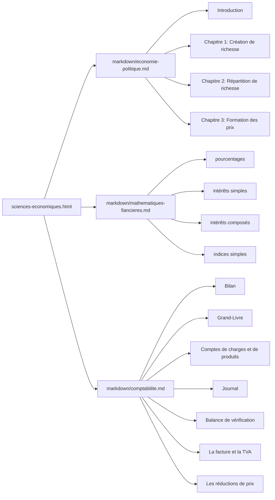
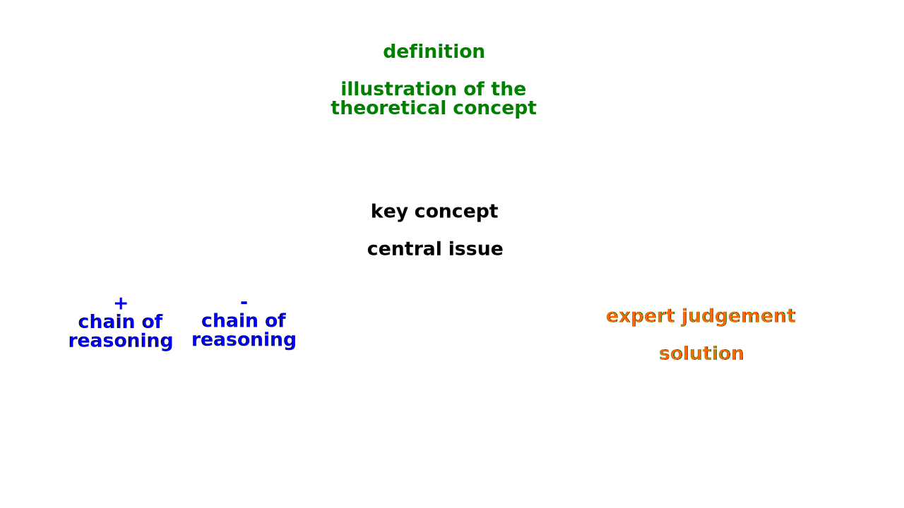

# Using reveal.js on GitHub in the classroom

## 1. Project overview



### 1.1. Structure of Slides



**Note**: The knowledge and understanding questions (green boxes) will guide the learner which *theoretical* concepts he/she should use in the analysis (blue box) and evaluation (orange box). 


### 1.2. Groupe de travail EcoPo ESC 3DG-1DG



## 2. Tools used in project

### 2.1. reveal.js

[reveal.js](https://revealjs.com/) allows to make nice presentations that are interactive and easy to visualize on mobile devices. The html presentations are hosted on `pages.github.io`.

### 2.2. Mermaid live editor

[Mermaid live editor](https://mermaid.live/edit): is used convert mermaid diagrams into svg. This tool allows to copy the URL of the svg directly into reveal.js without having to download the entire file.

### 2.3. MathJax

[MathJax](https://www.mathjax.org/) is supported by reveal.js and allows to include maths into the presentation.

### 2.4. D3.js

[D3.js](https://d3js.org/) is a JavaScript library made for data visualization.

### 2.5. blender

[blender](https://www.blender.org/) is used for video editing and for the creation of animations.

## 3. Frequently used code

### 3.1. Controlling the the size of equations

```html
<div style="font-size: 133%;">
<p>\begin{equation} \frac{\partial e_b}{\partial x^b} = &nbsp;&nbsp;\Gamma_{ab}^k &nbsp;e_k &nbsp; \end{equation}</p>
</div>
```

### 3.2. Including a figure with caption

```html
<figure>
  
  <figcaption> <font size="5"> Caption Text Here. </font> </figcaption>
</figure>
```

### 3.3. Controlling the slide background

```html
<section data-background="#dddddd">
  <h3> title of unit </h3>
  <ol type="1">
    <li> item 1 </li>
    <li> item 2 </li>
    <li> item 3 </li>	
    </ol>
</section>
```


### 3.4. Using hyperlinks

```html
<a href="https://www.ocaktan.org/"> Your text here </a>
```

### 3.5. Using TikZJax

[TikZJax](https://tikzjax.com/)

In the `<head>` of your HTML, include

```html
<link rel="stylesheet" type="text/css" href="https://tikzjax.com/v1/fonts.css">
<script src="https://tikzjax.com/v1/tikzjax.js"></script>
```

Then in the `<body>`, include TikZ code such as

```html
<script type="text/tikz">
  \begin{tikzpicture}
    \draw (0,0) circle (1in);
  \end{tikzpicture}
</script>
```

### 3.6. Opening a pdf at a specific page

We can use the following html code to create a link to a pdf document that opens ata specific page :

```html
<a href="https://website.com/files/document.pdf#page=11">document description</a>
```

Unfortunatly, there seems to be an inconsistency on how this link is interpreted whether you are on a Desktop (no matter which OS) or on a tablet (iOS or Android). This can be solved by using the following javascript code, that has to be placed in a folder that is accessible by the reveal.js file.

```js
document.addEventListener('DOMContentLoaded', function() {
    if (/Android|webOS|iPhone|iPad|iPod|BlackBerry/i.test(navigator.userAgent) || (/Android|webOS|iPhone|iPad|iPod|BlackBerry/i.test(navigator.platform)) || (navigator.maxTouchPoints && navigator.maxTouchPoints > 2 && /MacIntel/.test(navigator.platform))) {
    document.querySelectorAll('[href*=pdf]').forEach(e => {
    if (e.href.indexOf('page=') > -1) {
    e.href = e.href.replace('page=', 'page');
    }
    });
    }
    });
```

For more information read [this](https://element.how/web-link-to-specific-pdf-page/).


## 4. Economic and social data sources

- [<b>Our World in Data</b>: Data visualization on poverty, disease, hunger, climate change, war, existential risks, and inequality](https://ourworldindata.org/) 
- [OECD Data](https://data.oecd.org/)
- [eurostat Database](https://ec.europa.eu/eurostat/data/database)
- [LUSTAT (Statec)](https://lustat.statec.lu/)
- [Observatoire de l'habitat (Luxembourg)](https://logement.public.lu/fr/observatoire-habitat.html)
- [European Central Bank Data Portal](https://data.ecb.europa.eu/)
- [World Bank Open Data](https://data.worldbank.org/)
- [International Monetary Fund Data](https://www.imf.org/en/Data)
- [Federal Reserve Economic Data](https://fred.stlouisfed.org/)
- [United Nations Data](http://data.un.org/)
- [World health Organization Data Collection](https://www.who.int/data/collections)
- [Natural History Museum Data Portal](https://data.nhm.ac.uk/)
- [Fichier des prénoms (INSEE)](https://www.insee.fr/fr/statistiques/7633685)


## 5. Templates

### 5.1. svg file for structured writing



