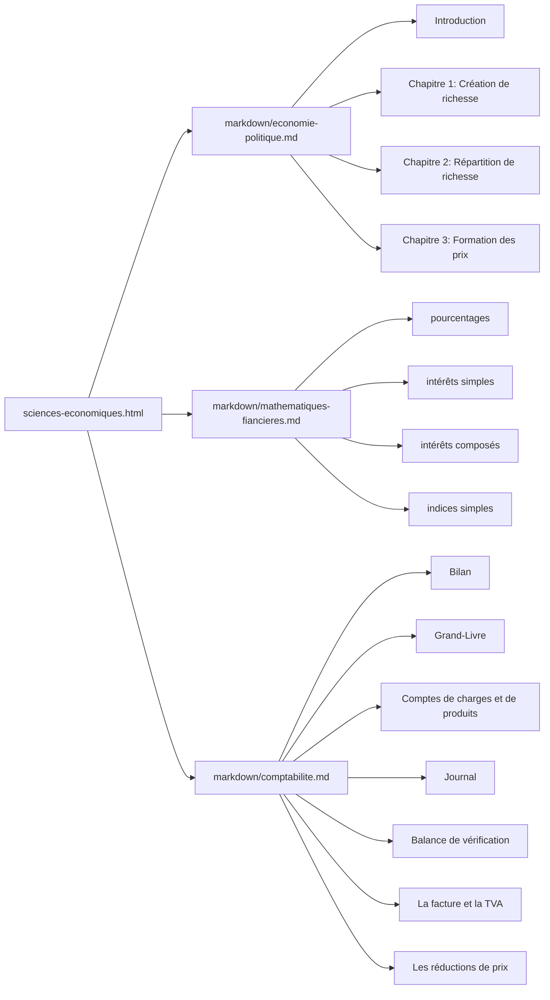

# Using reveal.js on GitHub in the classroom

```mermaid
graph LR;
    A[sciences-economiques.html] -->A1[markdown/economie-politique.md]
    A1 --> A11[Introduction]
    A1 --> A12[Chapitre 1: Création de richesse]
    A1 --> A13[Chapitre 2: Répartition de richesse]
    A1 --> A14[Chapitre 3: Formation des prix]
    A --> A2[markdown/mathematiques-fiancieres.md]
    A2 --> A21[pourcentages]
    A2 --> A22[intérêts simples]
    A2 --> A23[intérêts composés]
    A2 --> A24[indices simples]
    A --> A3[markdown/comptabilite.md]
    A3 --> A31[Bilan]
    A3 --> A32[Grand-Livre]
    A3 --> A33[Comptes de charges et de produits]
    A3 --> A34[Journal]
    A3 --> A35[Balance de vérification]
    A3 --> A36[La facture et la TVA]
    A3 --> A37[Les réductions de prix]
```